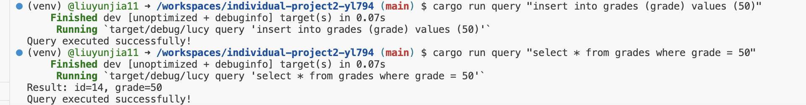

# Individual Project 2

This project I read a csv file and load data into database, then do CRUD on the databse using CLI tools.
video link here: 

## Requirements:

reqwest = { version = "^0.11", features = ["blocking"] }
rusqlite = "^0.29"
csv = "^1.0"
assert_cmd = "^2.0"
predicates = "0.9"

## Getting Started:

To get started with this project:

1. run cargo build to read config in Cargo.toml and build a new project.
2. run cargo load to load data from csv file.
3. run cargo query [query] to do queries.

## Result
Here is the result for Create:

Here is the result for Read:

Here is the result for Update:

Here is the result for Delete:

